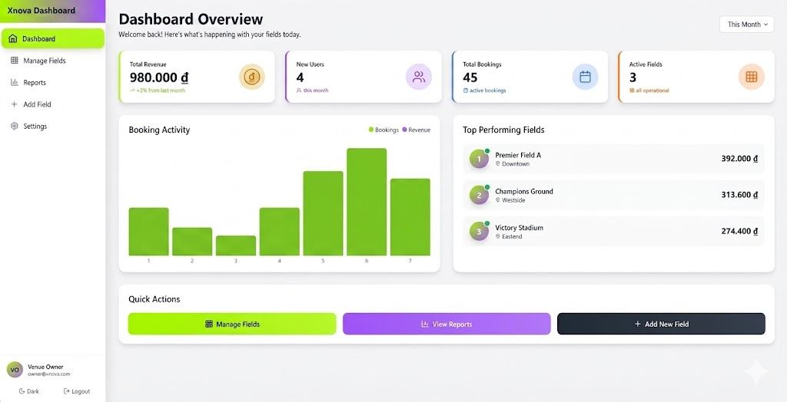
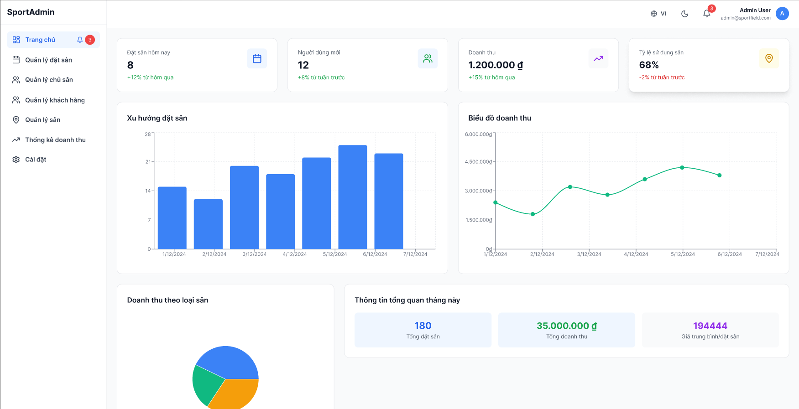
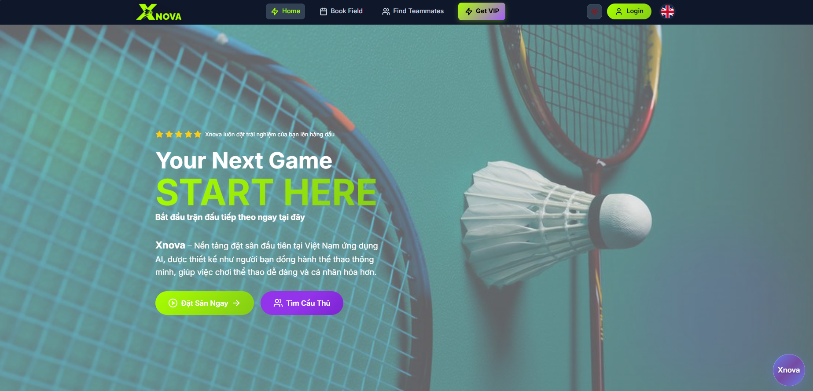

# Smart Court Booking Website

A frontend web platform for sports court booking and management. It provides role-based access (Admin, Owner, User), interactive schedule management, and online payment integration. This repository contains the frontend application only; the backend API is maintained separately.

## Preview





## My Contributions (TniTni)

- **Owner schedule management dashboard** — calendar UI for owners to create, view, and update booking slots with live availability.
- **Admin management portal** — platform-wide management of users, venues, and role/permission settings.
- **RESTful API integration** — integrated with backend endpoints to keep booking state synchronized across views.

## Features

- Role-based access control (Admin, Owner, User)
- Interactive calendar-based schedule management
- Secure online payment integration
- Booking synchronization via REST API (polled) — can be upgraded to real-time (WebSocket/socket.io) if the backend provides a realtime endpoint
- Responsive UI for mobile and desktop

## Technologies

| Category | Stack |
|---|---|
| Frontend | React, Vite |
| Styling | Plain CSS (component styles under `src/app/components` and `src/app/ui`) |
| State Management | React Context API |
| HTTP Client | RESTful API (fetch/axios on services) |
| Build Tool | Vite |
| Version Control | Git |

## Getting Started

### Prerequisites

- Node.js (v16+ recommended) — check your Node version with `node -v`
- npm (bundled with Node) or yarn

### Install

Install dependencies:

```bash
npm install
```

### Development

Run the dev server (Vite):

```bash
npm run dev
```

Open http://localhost:5173 (or the address shown by Vite).

### Build / Preview

Build for production:

```bash
npm run build
```

Preview the production build locally:

```bash
npm run preview
```

### Linters

Run ESLint:

```bash
npm run lint
```

### Environment Variables

Create a `.env` file in the project root (this repo uses Vite):

```
VITE_API_URL=https://your-backend-api-url.com
```

You can store local overrides in `.env.local` or use a `.env.example` for reference.

## Project Structure (partial)

```
src/
├── app/                # App entry and layout components
│   ├── components/     # Reusable UI components
│   └── pages/          # Page views (user/owner/admin)
├── routes/             # Route definitions
├── services/           # API calls and service wrappers
├── utils/              # Helper utilities
└── main.jsx            # App entry
```

## Scripts

- `npm run dev` — start development server
- `npm run build` — build production assets
- `npm run preview` — preview production build locally
- `npm run lint` — run ESLint

## Collaborators

- [TniTni](https://github.com/Tnitni) — Frontend Developer
- [PanpaKawaii](https://github.com/PanpaKawaii) — Frontend Developer

---

If you'd like, I can also:

- add a `.env.example` file with recommended variables,
- add a short CONTRIBUTING guide,
- or translate this README to Vietnamese.